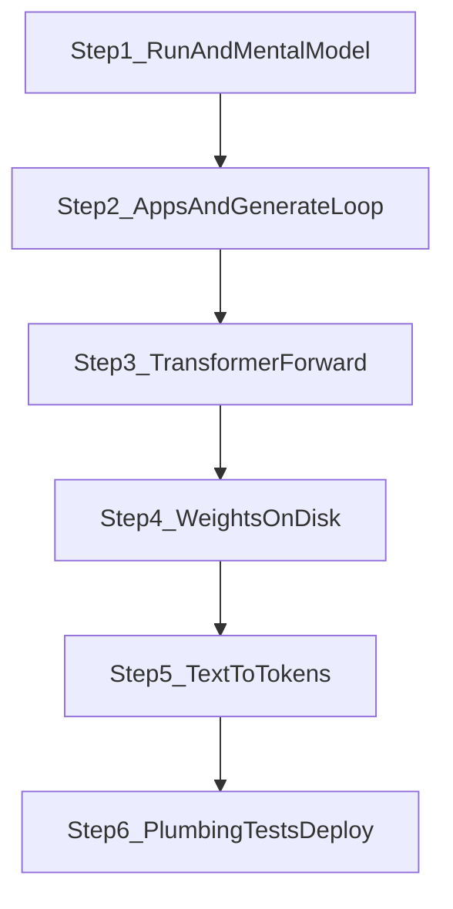
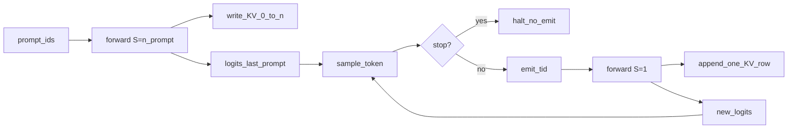
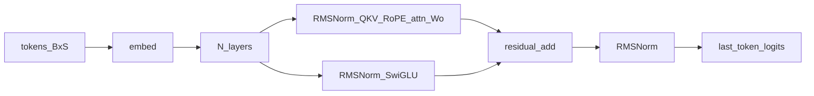

# Learner pass: how this model is inferred

This repo is a from-scratch **Llama / SmolLM2-360M Instruct** inference engine in C, with a NumPy twin in `py/`. There is no PyTorch and no llama.cpp at runtime.

**Pipeline:**

```
load GGUF → dequant Q8_0 to f32 → tokenize (GPT-2 BPE + ChatML)
  → transformer forward (RMSNorm, GQA, RoPE, SwiGLU, KV cache)
  → sample → decode tokens to text
```

You already know OS, Linux, and C. You are new to LLMs. Each step has two layers: **just enough model theory**, then **this repo’s code**. Python under `py/` is optional side-by-side reading (same architecture, easier math). The primary path is C.

Host build/run (CPU, AVX, PIM without gem5): [README.md](README.md).

**How to use this file with the chat**

- Read one step at a time. Stay there until it feels easy.
- In chat, quote a heading, a file, or a checkpoint question. Ask “why”, “walk this function”, or “encode this string”.
- Do not skip ahead to implementations before the mental model in Step 1 is solid.
- No code changes unless you ask for an experiment (print shapes, dump tokens, etc.).

**This checkpoint (measured from official `smollm2-360m-instruct-q8_0.gguf`)**

| Field | Value | Meaning |
| --- | ---: | --- |
| Name | SmolLM2-360M-Instruct | HuggingFaceTB official GGUF (`general.name` is the training run) |
| Architecture | `llama` | Required by `hparams_from_kv` |
| `n_layer` | 32 | Transformer blocks |
| `n_embd` (D) | 960 | Residual stream width |
| `n_head` (H) | 15 | Query heads |
| `n_head_kv` (KV) | 5 | Key/value heads (GQA, 3 query heads per KV head) |
| `head_dim` (d) | 64 | Per-head width (`960 / 15`) |
| `n_ff` (F) | 2560 | SwiGLU hidden size |
| `n_vocab` | 49152 | Logit / embed rows (tied `token_embd`) |
| `n_ctx` | 8192 | Max positions |
| `rms_eps` | 1e-5 | RMSNorm epsilon |
| `rope_theta` | 1e5 | RoPE base |
| Tokenizer | `gpt2` + `smollm` pretok | BPE + digit split |
| On disk | ~369 MB Q8_0 | 290 tensors |
| In RAM after load | ~1.35 GiB f32 | Then the mmap is dropped |

Build and run (see [README.md](README.md)): `cmake -B build && cmake --build build -j`. Default `all` suffixes binaries (`generate-cpu`, `chat-pim`, …). `-DLLM_BACKEND=cpu` keeps unsuffixed `generate` / `chat`.

```
./build/generate-cpu --prompt "Hello" --temp 0 --max-tokens 16
```

```
loading .../models/smollm2-360m-instruct-q8_0.gguf
  mmap quantized weights (~0.36 GiB packed, f32 would be ~1.35 GiB)
  load 290/290 tensors
Hello, I'm here to assist you with any language-related questions or problems
[16 tokens, 34 tok/s]
```

`build/test_quant-cpu` and `build/test_tokenizer-cpu` both pass (`ctest --test-dir build`).



---

## Step 1 — Run it and build the mental model

**Goal:** Watch inference happen, then name the pieces **without** reading implementations.

### 1.1 Theory

A **token** is an integer ID in a fixed vocabulary (here 49,153 entries). The model does not see characters or words. It sees a list of ints.

The model is a function:

```
token_ids[0..S)  →  logits[0..n_vocab)
```

**Logits** are raw scores, one per vocab entry. They are not probabilities until you softmax them (Step 2).

**Autoregression:** sample one next token from those logits, append it to the sequence, run the model again, repeat until a stop token or `max_tokens`.

**Prefill vs decode:**

- **Prefill:** first forward sees the whole prompt (`S = n_prompt`). Writes a K and V vector for every prompt position into the **KV cache**.
- **Decode:** later forwards see one new token (`S = 1`) and attend over the cache instead of recomputing the prompt.

That is why the first step is slower: prefill cost scales with prompt length. Decode cost is roughly constant per new token (attention still walks the growing cache, but there is only one new query).

### 1.2 ChatML (black box)

`generate` does not send raw `"Hello"`. It wraps the user string:

```
<|im_start|>user
Hello<|im_end|>
<|im_start|>assistant
```

`<|im_start|>` and `<|im_end|>` are **special tokens** (one ID each, not split by BPE). The model was trained to continue after `<|im_start|>assistant\n`. That is why greedy `"Hello"` became a greeting, not a random continuation of the word Hello.

### 1.3 Call graph only (names, not bodies)

Both `generate` and `chat` bootstrap the same way:

```
main
  load_model(path, dequant=1)      // gguf.c: mmap + Q8_0 → f32
  llama_model_init(loaded)         // model.c: bind weight pointers
  tokenizer_from_gguf(...)         // tokenizer.c: vocab + merges
  apply_chat_template(...)         // wrap user text in ChatML
  generate_start / generate_next   // generate.c: prefill then decode
    llama_model_forward            // model.c: the transformer
    sample_token                   // sampler.c: logits → next id
    stream_decoder_push            // tokenizer.c: id → UTF-8 chunk
```

### 1.4 Files this step (roles only)

| File | Role |
| --- | --- |
| [`c/generate_main.c`](c/generate_main.c) | One-shot CLI (`--prompt`, `--batch-demo`) |
| [`c/chat.c`](c/chat.c) | Multi-turn REPL + KV-cache prefix reuse |
| [`c/include/generate.h`](c/include/generate.h) | Prefill/decode state machine API |
| [`c/include/model.h`](c/include/model.h) | `llama_model_forward(tokens, B, S, cache) → logits (B, vocab)` |

Skim [`py/README.md`](py/README.md) for the same module table on the Python side.

### 1.5 Commands to run

```bash
# greedy one-shot (deterministic)
./build/generate-cpu --prompt "Hello" --temp 0 --max-tokens 16

# AVX2, or PIM in-process Device (no gem5)
./build/generate-x86_64 --prompt "Hello" --temp 0 --max-tokens 16
./build/generate-pim --prompt "Hello" --temp 0 --max-tokens 16

# sampled (default temp 0.8, top_p 0.9)
./build/generate-cpu --prompt "Hello" --max-tokens 32

# two prompts in one padded batch
./build/generate-cpu --batch-demo --max-tokens 16

# interactive (empty line or /exit to quit, /reset to clear history)
./build/chat-cpu --temp 0 --max-tokens 64
```

PIM desktop runs use `PIM_ISSUE=host` (the default). Do not set `mmio`/`shm` unless you are on the gem5/hybrid path. Full usage: [README.md](README.md).

### 1.6 Checkpoint

Answer these in your own words before Step 2:

1. Prompt → ? → logits → ? → text. Fill the blanks and say who does each hop.
2. Why is the first generated token slower than the tenth?
3. What is ChatML doing at a black-box level? Why does `"Hello"` become a greeting?

**Discuss in chat:** quote a checkpoint item, or ask to dump the ChatML string / token IDs for a prompt you choose.

---

## Step 2 — Application layer: generation loop and sampling

**Goal:** Own the outer loop as if you were writing a tiny `generate` CLI.

### 2.1 Theory: how a token is chosen

`sample_token(logits, n_vocab, temperature, top_k, top_p, rng)` in [`c/sampler.c`](c/sampler.c):

| Mode | When | Behavior |
| --- | --- | --- |
| Greedy | `temperature <= 0` or `top_k == 1` | `argmax` — always the largest logit |
| Temperature | `temp > 0` | Divide logits by temp, then softmax. Higher temp → flatter distribution |
| Top-k | `top_k > 0` | Keep the k largest logits; set the rest to `-inf` |
| Top-p (nucleus) | `top_p < 1` | Sort by probability; keep the smallest prefix whose CDF exceeds `top_p` (plus the token that crosses), renormalize |

Then draw `u ~ Uniform(0,1)` and walk the CDF. RNG is xorshift (`rng_u64`). `generate_text` seeds from `time(NULL)`; `generate_batch` seeds with `1` so the demo is deterministic.

**Why chat can reuse a KV cache:** turn N+1 is turn N plus a suffix (new user message + assistant prompt). The prefix token IDs did not change, so the K/V rows already stored for that prefix are still valid.

### 2.2 `generate_main.c`

Parse flags (`--model`, `--prompt`, `--max-tokens`, `--temp`, `--top-p`, `--top-k`, `--batch-demo`). Then:

```c
LoadedModel *loaded = load_model(model_path, 1, 1);
LlamaModel *model = llama_model_init(loaded);
Tokenizer *tok = tokenizer_from_gguf(loaded->gguf, &loaded->hparams);
```

Default path: wrap `--prompt` as one user ChatML message, call `generate_text(..., parse_special=1, stream=1, cache=NULL)`.

`--batch-demo`: two ChatML prompts (`"Say hi in one word."`, `"2+2="`), `generate_batch` with `temp=0`.

Host builds bake `LLM_DEFAULT_MODEL` to `models/smollm2-360m-instruct-q8_0.gguf`. Android builds do not (Step 6).

### 2.3 `generate.h` / `generate.c`

`GenerateState` holds: model, tokenizer, KV cache, `own_cache`, sampling knobs, `n_generated`, `done`, RNG, pointer to current logits.

**Prefill** (`generate_start`):

```c
st->logits = llama_model_forward(st->model, prompt_ids, 1, n_prompt, st->cache, NULL, NULL);
```

`B=1`, `S=n_prompt`. `valid_len=NULL` means “all S tokens are real.” After this, `st->logits` is `(1, vocab)` for the **last** prompt token.

**Decode** (`generate_next`):

1. If `done` or `n_generated >= max_tokens`, return 1 (stopped).
2. `tid = sample_token(st->logits, ...)`.
3. If `tid` is a stop ID, set `done` and return 1 **without emitting** the stop token.
4. Write `tid` to the caller, increment `n_generated`.
5. `st->logits = llama_model_forward(..., &tid, B=1, S=1, ...)`.

Sample happens **before** the one-token forward. The forward prepares logits for the *next* call.

`generate_text`: encode prompt → `generate_start` → loop `generate_next` → `stream_decoder_push` → optional `[N tokens, X tok/s]`.

If `cache == NULL`, `generate_state_init` allocates one (`own_cache=1`) sized to `n_ctx` and frees it in `generate_state_free`. Chat passes an existing cache (`own_cache=0`).

### 2.4 Worked 3-token prompt

Prompt IDs `[A, B, C]`:

1. `generate_start`: `forward([A,B,C], S=3)` writes K/V at positions 0,1,2. Logits = P(next \| A,B,C). `n_seq=3`.
2. `generate_next`: sample `D`. Emit `D`. `forward([D], S=1)` writes K/V at position 3. Logits = P(next \| A,B,C,D). `n_seq=4`.
3. Repeat until stop or `max_tokens`.



### 2.5 Batch path (`generate_batch`)

1. Encode each prompt. Pad to `slen = max(lengths)` with `pad_id`.
2. Prefill: `forward(batch, B=n_prompts, S=slen, valid_len=lengths)` so padding is ignored.
3. Each step: sample row `b` from `logits + b * n_vocab`. Finished rows set `valid[b]=0` and send `eos_id` as a dummy next token so their cache is not extended.
4. Stop when every row is done or `max_tokens` is hit.

### 2.6 Stop tokens

`is_stop` checks `tok->stop_ids`, filled in `tokenizer_from_gguf`:

- `hparams.eos_id` (this file: 2)
- literal `"END"` if present in vocab
- literal `"ĠEND"` (GPT-2 encoding of a leading space + END) if present

The stop token is **not** appended to the output ID list.

### 2.7 `chat.c`

- Allocates **one** `KVCache` for the session (`batch=1`, `--ctx` default 2048).
- Keeps `history[]` of `{role, content}` and `cached_ids` (token IDs already in the cache).
- Each turn: append user message → `apply_chat_template(history, nh, add_gen=1)` → encode.
- If new IDs start with `cached_ids` (`prefix_equal`), prefill **only the suffix**. Else `kvcache_reset` and prefill everything.
- Stream via `generate_start` / `generate_next` / `stream_decoder_push`.
- After the reply: strip a trailing `END` for display, append `{assistant, reply}` to history, set `cached_ids = old_prompt_ids + gen_ids`.
- `/reset` frees history, clears `cached_ids`, `kvcache_reset` (zeros `n_seq` only; K/V arrays are overwritten later).

### 2.8 Checkpoint

1. Draw prefill vs decode. Mark where K/V is written and when `n_seq` advances.
2. When does generation stop? What is printed vs discarded?
3. Why does `chat.c` keep one cache across turns instead of `kvcache_create` every turn?

**Discuss in chat:** walk `generate_next` with a prompt you pick; or explain what happens if the user edits an earlier chat turn (prefix mismatch).

---

## Step 3 — Transformer forward (the core)

**Goal:** Read `llama_model_forward` as a systems person: shapes, memory, residual dataflow — not as a research paper.

### 3.1 Theory (tied to this checkpoint)

**Embedding table** `token_embd.weight` is `(n_vocab, D) = (49152, 960)`. Token ID `t` copies row `t` into the residual stream `x`.

**Residual stream:** a `D`-vector per token that every layer reads and writes with `x += attn(...)` and `x += ffn(...)`.

**RMSNorm** (not LayerNorm): no mean subtraction.

```
y_i = x_i / sqrt(mean(x^2) + eps) * weight_i
```

`eps = rms_eps = 1e-5`. Applied before attention, before FFN, and once at the end.

**GQA (grouped-query attention):** 15 query heads share 5 KV heads. Query head `h` reads KV head `h / 3` (`n_rep = H / KV = 3`). Saves cache memory: K/V store 5 heads, not 15.

**RoPE (rotary position embedding), llama.cpp NORM / consecutive-pair style:** rotate pairs `(x0,x1), (x2,x3), …` by an angle that depends on position `t` and pair index `i`:

```
θ_{t,i} = t * rope_theta^{-i / (head_dim/2)}
[x0'] = [cos θ  -sin θ] [x0]
[x1']   [sin θ   cos θ] [x1]
```

This is **not** the “half-and-half” GPT-NeoX layout. `build_rope_cache` stores `cos/sin` as `(seq_len, head_dim)` with each pair duplicated (`c,c` and `s,s`).

**Causal attention:** query at position `qpos` may only see keys `kp <= qpos`. Future tokens in the same prefill chunk are masked with `-inf` before softmax.

**SwiGLU FFN:**

```
g = silu(W_gate @ h)     # silu(x) = x / (1 + exp(-x))
u = W_up @ h
x += W_down @ (g * u)
```

Widths: `D=960 → F=2560 → D=960`.

**Weight-tied LM head:** there is no `output.weight`. Last-token hidden state is projected with the **same** `token_embd` table: `logits = tok_embd @ h_last` (`n_vocab × D`).



### 3.2 `backends/cpu/tensor.c` / `tensor.h`

No tensor object. Everything is `float *` plus explicit sizes.

| Function | Meaning |
| --- | --- |
| `linear(W, x, y, n_out, n_in)` | `y = W @ x`, `W` row-major `(n_out, n_in)`. Naive loops. Almost all runtime. |
| `linear_rows` | Same, for `n_tok` rows |
| `rmsnorm` / `rmsnorm_rows` | See formula above |
| `silu` | SwiGLU gate |
| `softmax_inplace` | Subtract max, exp, divide by sum |
| `vec_add` / `vec_mul` | Residual add; SwiGLU product |
| `argmax_f32` | Greedy sample |

### 3.3 `backends/cpu/rope.c` / `rope.h`

- `build_rope_cache(cos, sin, seq_len, head_dim, theta)` — tables used by every layer.
- `apply_rope(x, cos, sin, positions, B, n_head, S, head_dim)` — in-place on `x` shaped `(B, n_head, S, head_dim)`. `positions` is `(B, S)`.

Decode (`S=1`) still gets the right rotation because `positions[b,0] = cache.n_seq[b]`, not 0.

Attention kernels live in `backends/cpu/attn.c` (`attn_pack_heads`, `attn_cache_store`, `attn_gqa`, `attn_merge_heads`). `model.c` is the layer graph; `-DLLM_BACKEND=cpu` selects this scalar backend.

### 3.4 `cache.c` / `cache.h`

```
k, v: (n_layer, batch, n_head_kv, max_seq, head_dim)
n_seq: (batch,) write cursor
```

Strides:

```
layer_stride = batch * n_head_kv * max_seq * head_dim
batch_stride = n_head_kv * max_seq * head_dim
head_stride  = max_seq * head_dim
```

`kvcache_reset` zeros `n_seq` only. It does not wipe K/V; the next write overwrites.

Size for `batch=1`, `max_seq=2048` on this model:

```
32 * 1 * 5 * 2048 * 64 * 2 (K+V) * 4 bytes ≈ 168 MiB
```

### 3.5 `model.h` structs

`LayerWeights` — pointers into dequantized weights for one block:

`attn_norm, wq, wk, wv, wo, ffn_norm, gate, up, down`

`LlamaModel` — hparams, those pointers, RoPE tables, scratch:

`x, h, q, k, v, attn, y, ffn_gate, ffn_up, logits, positions, key_len, starts`

Scratch is allocated lazily in `ensure_scratch` on the first forward (grows if B/S/max_k increase).

`llama_model_init` does **not** copy weights. It binds names:

```
token_embd.weight
output_norm.weight
blk.{i}.attn_norm.weight
blk.{i}.attn_q.weight / attn_k.weight / attn_v.weight / attn_output.weight
blk.{i}.ffn_norm.weight
blk.{i}.ffn_gate.weight / ffn_up.weight / ffn_down.weight
```

Missing name → `die`.

### 3.6 `llama_model_forward` step by step

Input: `tokens` `(B, S)` row-major. Optional `valid_len[b]` (NULL ⇒ all S). Output: logits `(B, vocab)` for the last **valid** token per row.

**1. Positions**

```
starts[b]        = cache.n_seq[b]
positions[b, t]  = starts[b] + t     for t < valid_len[b]
key_len[b]       = starts[b] + valid_len[b]
```

Die if `key_len > cache.max_seq`.

**2. Embed**

`x[b,s,:] = tok_embd[tokens[b,s], :]`  (960 floats)

**3. For each of 32 layers**

Attention:

1. `h = RMSNorm(x, attn_norm)` over D.
2. `q = Wq @ h` → 15×64; `k = Wk @ h` → 5×64; `v = Wv @ h` → 5×64.  
   Temps reuse `y` / `ffn_gate` / `ffn_up`, then scatter to `(B, heads, S, d)`.
3. `apply_rope` on q (15 heads) and k (5 heads) using `positions`.
4. Write new k,v into the cache at `[starts .. key_len)`.
5. For each query head `h`, KV head `kv_h = h / 3`, each query slot `s`:
   - `score[kp] = (q · k[kp]) / sqrt(64)`
   - mask if query is padding, or `kp > qpos`, or `kp >= key_len[b]`
   - softmax over `max_k`
   - `y = Σ_kp softmax(score)[kp] * V[kp]`
6. Merge 15 heads → 960, `proj = Wo @ merged`, `x += proj`.

FFN:

1. `h = RMSNorm(x, ffn_norm)`
2. `g = silu(Wgate @ h)`, `u = Wup @ h`, `g *= u`
3. `x += Wdown @ g`

**4. Final norm + tied head**

`h = RMSNorm(x, output_norm)`. For each batch row, take `last = valid_len[b]-1`, then:

```
logits[b] = tok_embd @ h[b, last]
cache.n_seq[b] = key_len[b]
```

### 3.7 Scratch buffer roles

| Buffer | Approx shape | Job |
| --- | --- | --- |
| `x` | B×S×D | Residual stream |
| `h` | B×S×D | Post-RMSNorm; merged heads |
| `q` | B×H×S×d | Queries |
| `k`, `v` | B×KV×S×d | New-chunk K/V before cache write |
| `attn` | B×H×S×max_k | Attention scores |
| `y` | mixed | Attn output; Q linear temp; FFN down |
| `ffn_gate`, `ffn_up` | B×S×F | SwiGLU; also K/V linear temps |
| `logits` | B×vocab | Last-token scores |
| `positions`, `key_len`, `starts` | ints | Cache addressing |

### 3.8 Why last-token logits only

Sampling only needs P(next \| prefix). A full `(B, S, vocab)` projection would be a 49152×960×S matmul for no benefit. Training wants every position; inference does not.

### 3.9 What breaks if you…

- **Skip the causal mask:** during prefill, token t attends to future keys in the same chunk (cheating). Decode with `S=1` can look fine until the next prefill.
- **Forget `cache.n_seq = key_len`:** the next decode overwrites the same cache rows. History is truncated or corrupted; RoPE positions desync.

### 3.10 One layer, one head — shape drill

Take layer 0, query head 0, batch 1, prefill `S=8`:

| Tensor | Shape | Notes |
| --- | --- | --- |
| `x` row | 960 | Residual |
| `h` after attn RMSNorm | 960 | |
| `q` head 0 | 64 | `Wq` is (960, 960) = 15×64 |
| `k`,`v` head 0 | 64 | `Wk`/`Wv` are (320, 960) = 5×64 |
| cache write | 5 heads × 8 × 64 | KV heads only |
| `attn` row | `key_len` (8 on first prefill) | scores |
| `y` head 0 | 64 | weighted V |
| merged | 960 | 15×64 |
| after `Wo` | 960 | added to `x` |
| FFN gate/up | 2560 | then down to 960 |

**Discuss in chat:** pick `S=1` decode after that prefill and re-list the shapes. Or walk attention for head 14 (which KV head?).

### 3.11 Checkpoint

1. Walk `llama_model_forward` and say what each scratch buffer is for.
2. Why are logits `(B, vocab)` for the last valid token, not every position?
3. What breaks if you skip the causal mask, or forget to update `cache.n_seq`?

---

## Step 4 — Weights on disk: GGUF and Q8_0

**Goal:** See how a `.gguf` file becomes the `float *` pointers `model.c` uses.

### 4.1 Theory

**GGUF v3** is a container, not a model architecture:

```
mmap the file
magic "GGUF" | u32 version (must be 3) | u64 n_tensors | u64 n_kv
n_kv times:   key string, type tag, value (scalar / string / array)
n_tensors:    name, n_dims, dims[ggml order], ggml_type, offset
pad to alignment (default 32)
tensor blob
```

This file: 43 KV pairs, 290 tensors, `general.architecture = "llama"`.

**Q8_0 block:** 34 bytes = 2-byte fp16 scale + 32 int8 values (`QK8_0=32`).

```
out[i] = (float)qs[i] * fp16_to_fp32(scale)
```

This engine **dequantizes every tensor to f32 at load**, then `munmap`s the file. Runtime matmuls are naive f32. You pay ~1.35 GiB RAM to keep the code simple.

**Dim order:** GGUF/ggml stores `ne[0]` innermost. `WeightTensor.shape` reverses that to NumPy / row-major so `linear` treats `W` as `(n_out, n_in)` (same as `torch.nn.Linear.weight`).

### 4.2 `gguf.h` types

| Struct | Owns |
| --- | --- |
| `GGUFFile` | mmap, KV arrays, `TensorInfo[]`, `data_offset` |
| `GGUFValue` | One typed metadata value |
| `TensorInfo` | name, ggml dims, type (`GGML_F32=0`, `GGML_Q8_0=8`), offset into blob |
| `LlamaHParams` | The table in the intro |
| `WeightTensor` | name, f32 `data`, reversed `shape` |
| `LoadedModel` | `GGUFFile*` + hparams + `weights[]` |

### 4.3 `open_gguf` vs `load_model`

`open_gguf` (`gguf.c`): `open` + `mmap` + parse magic/version/KV/tensor index + compute aligned `data_offset`. Does **not** copy weight bytes.

`hparams_from_kv`: requires `general.architecture == "llama"`, then reads `llama.embedding_length`, `llama.block_count`, `llama.attention.head_count`, `head_count_kv`, `key_length`, `feed_forward_length`, `vocab_size`, `context_length`, RMS eps, RoPE theta, tokenizer IDs, chat template, `tokenizer.ggml.pre`.

`load_model(path, dequant=1, progress=1)`:

1. `open_gguf` + `hparams_from_kv`
2. For each tensor: `dequant_tensor` → malloc `n_elements` floats (Q8_0 or raw f32)
3. Reverse dims into `shape[]`
4. `gguf_unmap` — drop the 369 MB mapping; KV metadata stays in RAM

`loaded_find_weight(name)` is a linear scan. `llama_model_init` → `must_weight` → that scan. Missing → `die`.

### 4.4 `quant.c` and a block by hand

`fp16_to_fp32` is a bit-level IEEE conversion (subnormals, inf/NaN, bias 15 → 127).

`c/tests/test_quant.c` first case (do this on paper):

- scale = 0.5 (`fp16 0x3800`)
- `qs[i] = i - 16` for `i = 0..31`
- `y[0] = -16 * 0.5 = -8`
- `y[16] = 0`
- `y[31] = 15 * 0.5 = 7.5`

Second case: two blocks, scale 1.0 with qs=1 → all 1.0; scale 2.0 with qs=3 → all 6.0.

Ragged `n_elements % 32 != 0` is rejected.

```bash
./build/test_quant-cpu
```

### 4.5 Name map onto `LayerWeights`

| GGUF name | Field |
| --- | --- |
| `token_embd.weight` | `LlamaModel.tok_embd` (also LM head) |
| `output_norm.weight` | `LlamaModel.output_norm` |
| `blk.{i}.attn_norm.weight` | `L->attn_norm` |
| `blk.{i}.attn_q.weight` | `L->wq` |
| `blk.{i}.attn_k.weight` | `L->wk` |
| `blk.{i}.attn_v.weight` | `L->wv` |
| `blk.{i}.attn_output.weight` | `L->wo` |
| `blk.{i}.ffn_norm.weight` | `L->ffn_norm` |
| `blk.{i}.ffn_gate.weight` | `L->gate` |
| `blk.{i}.ffn_up.weight` | `L->up` |
| `blk.{i}.ffn_down.weight` | `L->down` |

32 layers × 9 tensors + embed + output_norm + extras ≈ 290 tensors.

### 4.6 Checkpoint

1. What does `open_gguf` own vs `load_model`?
2. Why do host and Android care about RAM after dequant even though the file is 369 MB?
3. How does `loaded_find_weight` connect to `llama_model_init`?

**Discuss in chat:** compute another Q8_0 block; or ask what would have to change to keep weights quantized at runtime.

---

## Step 5 — Text to tokens: tokenizer and Unicode

**Goal:** The largest C module, after you already know *why* tokens exist.

### 5.1 Theory

```
apply_chat_template
  → partition specials (<|im_start|>, …) if parse_special
  → pretokenize_smollm (each digit is its own word; else GPT-2-style split)
  → gpt2_byte_encode (byte → printable-ish Unicode)
  → bpe (merge heap ordered by rank)
  → token IDs
```

Decode inverts the byte map. Streaming decode must not print a split UTF-8 sequence.

### 5.2 ChatML (`apply_chat_template`)

Hard-coded in C, matching the Jinja stored in the GGUF:

```
<|im_start|>{role}\n{content}<|im_end|>\n
… + <|im_start|>assistant\n    if add_generation_prompt
```

### 5.3 `parse_special` on vs off

`tokenizer_from_gguf` requires `tokenizer.ggml.model == "gpt2"`. Loads `tokens`, `merges`, `token_type`.

A token is **special** if its type is unknown/control/user-defined, or it matches `<|...|>`. Specials are sorted **longest first** so `<|im_start|>` wins over a shorter prefix.

| `parse_special` | `<|im_start|>` |
| --- | --- |
| 1 | One ID (correct for ChatML) |
| 0 | Ordinary BPE of those characters (roundtrip-safe, ChatML-wrong) |

`c/tests/test_tokenizer.c`: encode `"Hello, world! 123 cats."` with `parse_special=0`, decode must equal input. Then ChatML `"Hi"` with `parse_special=1`: first ID is `<|im_start|>`, and `<|im_end|>` appears. Also checks `stop_ids` contains `eos`, `"END"`, `"ĠEND"`.

```bash
./build/test_tokenizer-cpu
```

### 5.4 Pretok and Unicode

`pretokenize_smollm`: walk UTF-8 codepoints; **each digit is its own word**; everything else goes through `gpt2_split` (contractions `'s/'t/'m/'d/'re/'ve/'ll`, letter runs, number runs, punctuation runs, whitespace rules).

`"123"` → three pieces before BPE. That is the SmolLM pretok difference from vanilla GPT-2.

[`c/unicode.c`](c/unicode.c): `utf8_decode` / `utf8_encode` / `utf8_codepoints`; `unicode_cat` binary-searches [`c/unicode_data.c`](c/unicode_data.c) (`UNICODE_RANGES[]`: letter / number / space / other). Treat `unicode_data.c` as data, not logic.

### 5.5 GPT-2 byte map

Bytes 0–255 map to Unicode codepoints that are all valid single UTF-8 characters (printable ASCII stays; the rest shift into the 256+ range). BPE runs on those characters. Decode uses `cp_to_byte`.

A leading space in a token often shows up as `Ġ` in the vocab (`"ĠEND"` = space + END).

### 5.6 BPE and why a heap appears

Start with one symbol per (byte-mapped) character. Repeatedly merge the adjacent pair whose key `"left right"` has the **lowest merge rank** (earlier in `tokenizer.ggml.merges` = more common in training).

[`c/heap.c`](c/heap.c) is a min-heap of `(rank, left_index, right_index)` matching Python `heapq` tuple order. After a merge, neighbor pairs are pushed; stale heap entries are skipped via `alive[]` / `next_idx[]`.

[`c/hashmap.c`](c/hashmap.c): FNV-1a + linear probing. Used for `token → id`, `merge string → rank`, and the special set.

### 5.7 Paper exercise: encode a short string

Do this on paper, then we can match `tokenizer_encode` in chat.

Example: `"Hi"` (no ChatML, `parse_special=0`)

1. Pretok: one letter-run `"Hi"` (no digits).
2. Byte-encode: `H` `i` stay ASCII codepoints.
3. BPE: start `["H", "i"]`. If `"H i"` is a merge, they become `"Hi"` (one token if that string is in vocab); else two IDs.
4. Lookup each piece in `token_to_id`.

Then try `"123"` (three digit pieces) and `"Hello, world!"`.

### 5.8 Decode and streaming

`tokenizer_decode`: IDs → vocab strings → bytes via `cp_to_byte`. If `skip_special`, drop specials.

`StreamDecoder` (`stream_decoder_push`):

1. Append this token’s bytes to an internal buffer.
2. If the whole buffer is valid complete UTF-8, emit it and clear.
3. Else try dropping 1–3 trailing bytes; emit the valid prefix and keep the incomplete tail.
4. If nothing is complete yet, emit `""`.

`stream_decoder_flush` dumps leftovers; invalid bytes become U+FFFD.

That is why chat can `fputs` each chunk without splitting a multibyte character (emoji, CJK).

### 5.9 Checkpoint

1. Difference between `parse_special` on vs off.
2. Why a heap appears in a tokenizer.
3. How `stream_decoder_push` avoids printing a split UTF-8 sequence.

**Discuss in chat:** pick a string and we encode it together; or ask what happens if you stream a 4-byte emoji that lands across two tokens.

---

## Step 6 — Plumbing, tests, and Android

**Goal:** Close the last files and the deploy path.

### 6.1 `util.c` / `util.h`

- `xmalloc` / `xcalloc` / `xrealloc` / `xstrdup` / `xstrndup` — die on OOM (`n==0` becomes 1).
- `die(fmt, ...)` — `error: …` on stderr, `exit(1)`.
- `IntVec` — doubling `int` array (token lists).
- `ByteVec` — doubling byte array (string build, stream decode).

No hidden framework. If you see `intvec_push` in generate/chat/tokenizer, this is it.

### 6.2 CMake ([`c/CMakeLists.txt`](c/CMakeLists.txt))

**In each `lib llm_<backend>` (or unsuffixed `llm` if one backend):**

Core: `util.c`, `hashmap.c`, `heap.c`, `quant.c`, `gguf.c`, `unicode.c`, `unicode_data.c`, `tokenizer.c`, `cache.c`, `model.c`, `sampler.c`, `generate.c`

| `-DLLM_BACKEND` | Extra sources | Notes |
| --- | --- | --- |
| `cpu` | `c/backends/cpu/{backend,tensor,rope,attn}.c` | Scalar reference |
| `x86_64` | `c/backends/x86_64/*` | AVX2/FMA + pool |
| `pim` | `c/backends/pim/*` + `pim_func` | Decode GEMV on Device; host default `PIM_ISSUE=host` |
| `all` | every available | Suffixed bins: `generate-cpu`, `test_linear-pim`, … |

**Not in the library:**

- `chat.c` → `chat` or `chat-<be>`
- `generate_main.c` → `generate` or `generate-<be>`
- `c/tests/test_quant.c` / `c/tests/test_tokenizer.c` / `c/tests/test_linear.c` / `c/tests/test_prompt.c` → host tests
- PIM also builds `test_planner` and `pim_hybrid_stub` (stub is for gem5 hybrid only)

Host (not cross, not Android): `#define LLM_DEFAULT_MODEL` to `${REPO}/models/smollm2-360m-instruct-q8_0.gguf`.

Cross/Android: no default model, no CTest targets. You must pass `--model`.

Native PIM does not need gem5. `PIM_ISSUE=mmio` and `shm` are gem5/hybrid only; see [README.md](README.md).

### 6.3 Android

[`c/scripts/build-android.sh`](c/scripts/build-android.sh):

- NDK CMake toolchain, `arm64-v8a`, `android-28`
- `ANDROID_STL=none`, `ANDROID_SUPPORT_FLEXIBLE_PAGE_SIZES=ON` (16 KiB pages)
- Output: `c/build-android/{chat,generate}`

[`c/scripts/adb-push.sh`](c/scripts/adb-push.sh):

- Push binaries + GGUF to `/sdcard/Download/llm_infer`
- sdcard is usually **noexec** — do not `./generate`
- Run via the dynamic linker:

```bash
/system/bin/linker64 ./generate --model ./smollm2-360m-instruct-q8_0.gguf --prompt Hello --temp 0 --max-tokens 32
```

`--run` does a 16-token greedy smoke test over adb.

The process still needs ~1.35 GiB free RAM for f32 weights, plus the KV cache.

### 6.4 Full file map

| File | Job |
| --- | --- |
| `c/include/util.h` + `c/util.c` | Alloc, die, IntVec, ByteVec |
| `c/include/hashmap.h` + `c/hashmap.c` | String → int (vocab, merges) |
| `c/include/heap.h` + `c/heap.c` | BPE merge priority |
| `c/include/unicode.h` + `c/unicode.c` + `c/unicode_data.c` | UTF-8 + category table |
| `c/include/quant.h` + `c/quant.c` | Q8_0 / f32 / fp16 |
| `c/include/gguf.h` + `c/gguf.c` | GGUF v3 mmap + dequant load |
| `c/include/tokenizer.h` + `c/tokenizer.c` | ChatML, pretok, BPE, stream decode |
| `c/include/backend.h` + `c/backends/cpu/backend.c` | Compile-time backend name |
| `c/include/tensor.h` + `c/backends/cpu/tensor.c` | linear, RMSNorm, SiLU, softmax |
| `c/include/rope.h` + `c/backends/cpu/rope.c` | Consecutive-pair RoPE |
| `c/include/attn.h` + `c/backends/cpu/attn.c` | GQA attention, head pack/merge, KV store |
| `c/backends/x86_64/` | AVX2 linear/attn/RoPE + pthread pool |
| `c/backends/pim/` | GEMV planner + intern; host Device or gem5 issue |
| `c/include/cache.h` + `c/cache.c` | K/V arena + `n_seq` |
| `c/include/model.h` + `c/model.c` | Llama forward (calls backend kernels) |
| `c/include/sampler.h` + `c/sampler.c` | Greedy / temp / top-k / top-p |
| `c/include/generate.h` + `c/generate.c` | Prefill/decode loop |
| `c/generate_main.c` | One-shot CLI |
| `c/chat.c` | Multi-turn + prefix cache |
| `c/tests/test_quant.c` | Q8_0 block tests |
| `c/tests/test_tokenizer.c` | Roundtrip + ChatML specials |
| `c/tests/test_linear.c` | Kernel golden vs scalar ref |
| `c/tests/test_prompt.c` | Prompt-level golden + linear dump |
| `c/CMakeLists.txt` | lib + bins + host tests; `-DLLM_BACKEND` (`all` / `cpu` / `x86_64` / `pim` / …) |
| `c/backends/cpu/CMakeLists.txt` | Scalar CPU kernel sources |
| `README.md` | Host usage, `PIM_ISSUE`, tests (no gem5) |
| `c/scripts/build-android.sh` | NDK cross-compile |
| `c/scripts/adb-push.sh` | adb deploy + linker64 hint |
| `py/*.py` | NumPy reference (optional) |

### 6.5 Checkpoint

1. Which sources are in `lib llm` vs the two binaries?
2. Why must Android builds pass `--model`?
3. Name every `.c` / `.h` and its job, then place it on: load → tokenize → forward → sample → decode.

**Discuss in chat:** walk the Android run command; or ask what a host-only `#ifdef` would break on device.

---

## How a session in this chat should look

1. You say which step (or heading) you are on.
2. We recap the goal in a paragraph if needed.
3. We read the header, then the `.c`, function by function, tying back to the pipeline.
4. Optional: run a command or a test to confirm a claim.
5. We hit the checkpoint questions. **We do not start the next step until you say so.**

Start at **Step 1**. When you want to go deeper, paste a checkpoint answer or a file/function name.
